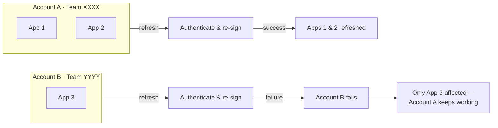

# MultiStore

> A **multi-account** fork of [SideStore](https://github.com/SideStore/SideStore) — sideload and refresh apps across **several Apple IDs at once**, from one app.

MultiStore is a fork of SideStore that adds support for **multiple Apple IDs**. You can add several Apple accounts, and every installed app **permanently remembers which account signed it**; refreshes are **automatically grouped per account**, so they always use the correct one. If one account has a problem (expired session, revoked certificate, reached the app limit), **only that account's apps are affected** — every other account keeps refreshing normally.

It's aimed at anyone who needs to manage multiple signing identities, teams or certificates from one installation without repeatedly signing out and replacing global credentials.

It uses the **MultiStore** display name while retaining SideStore's canonical source bundle identifier so iLoader can inject the certificate private key. iLoader appends the signing Team ID during installation, which keeps installations made with different Apple accounts isolated.

Everything SideStore already does still applies — untethered sideloading with just your Apple ID, on-device resigning via a [custom VPN](https://github.com/SideStore/em_proxy) + [minimuxer](https://github.com/SideStore/minimuxer), and automatic background refresh to beat the 7-day expiry. MultiStore extends SideStore with a *multi-account signing layer* while leaving the existing sideloading, refresh, and VPN workflow unchanged.

## Contents

- [Quick Start](#quick-start)
- [Why multiple accounts?](#why-multiple-accounts)
- [Features](#features)
- [Architecture](#architecture)
- [Screenshots](#screenshots)
- [Installation](#installing-on-your-device)
- [Using multiple accounts](#using-multiple-accounts)
- [FAQ](#faq)
- [Credits](#credits--acknowledgements)
- [License](#license)

## Quick Start

Want to get running quickly? Here's the short version:

1. Download the latest [release](https://github.com/chenbusi123/MultiStore/releases/latest) (or a build from **Actions** for the newest development version).
2. Sideload `SideStore-multi-account.ipa` with **[iLoader](https://github.com/nab138/iloader)** (recommended).
3. Import your **pairing file** when MultiStore asks (in iLoader: *Manage Pairing File → Export*).
4. Add one or more Apple IDs in **Settings → Account → `+` Add Account**.
5. Install and refresh apps as usual — each one is remembered and refreshed with its own account.

## Why multiple accounts?

Each free Personal Team uses seven-day provisioning profiles and is subject to Apple's development limits. MultiStore lets several accounts keep separate sessions, certificates and app assignments, all managed from a single app instead of repeatedly signing in and out.

> [!IMPORTANT]
> MultiStore does **not** bypass Apple's free developer restrictions. Apple's current rule is **up to three Personal Team apps per device**, so adding Apple IDs does not multiply that device-wide three-app limit. MultiStore manages multiple legitimate signing identities; exceeding the device limit requires a separate, device/OS-specific app-limit solution when one is available.

| Feature | AltStore | SideStore | MultiStore |
| --- | :---: | :---: | :---: |
| In-app refresh (no AltServer / no computer) | ❌ | ✅ | ✅ |
| Multiple Apple IDs | ❌ | ❌ | ✅ |
| Separate credentials/certificates for multiple accounts | ❌ | ❌ | ✅ |
| Per-app signing account | ❌ | ❌ | ✅ |
| Independent per-account refresh | ❌ | ❌ | ✅ |
| Failure isolation | ❌ | ❌ | ✅ |
| Side-by-side install (different signing teams, or LiveContainer host) | ❓ | — | ✅ |

❓ possible but unverified &nbsp;·&nbsp; — not applicable (installing SideStore beside SideStore makes no sense)

## Features

- **Multiple Apple Developer accounts** with isolated authentication sessions, certificates, teams and credentials.
- **Permanent app → account binding** — each `InstalledApp` stores a `signingAccountID`; refreshes are **partitioned per account** and run independently.
- **Failure isolation** — one account failing never stops the others from refreshing.
- **Automatic data migration** — updating MultiStore converts any existing single-account data in its *own* store to the multi-account model in place, with no data loss (it does not import a separate SideStore install — see the [FAQ](#faq)).
- **Minimal account UI** — add / remove / view accounts and their status in Settings, set a default account, and change any app's signing account.
- **Coexists across signing teams** — iLoader's Team-ID suffix gives each account a distinct installed bundle identifier, keychain access group and app group.

Deep dives:
- [`docs/multi-account/ARCHITECTURE.md`](./docs/multi-account/ARCHITECTURE.md) — how SideStore's single-account assumptions were analyzed.
- [`docs/multi-account/PLAN.md`](./docs/multi-account/PLAN.md) — the implementation plan, data-model change and migration strategy.

## Architecture

Each app is bound to the account that signed it via a stable `signingAccountID` — resolved to that account's Apple Developer **Team ID** and signing certificate, never a display name or email. At refresh time apps are grouped by account, and each account is authenticated and re-signed **independently** — so one account's failure is isolated to its own apps.

### In practice

| Scenario | SideStore | MultiStore |
| --- | --- | --- |
| An account's session expires | All refreshes fail | Only that account's apps fail |
| A certificate is revoked | Manual recovery | Only the affected account's apps stop |
| Juggling multiple Apple IDs | Manual, one at a time | Built in |

## Screenshots

<table>
  <tr>
    <td align="center"></td>
    <td align="center"></td>
    <td align="center"></td>
  </tr>
  <tr>
    <td align="center">Multiple Apple accounts signed in</td>
    <td align="center">Move a signed app to another account</td>
    <td align="center">Each app records the account that signed it</td>
  </tr>
</table>

The sideloaded app shown is <em>Geometry Dash</em> — © <a href="https://www.robtopgames.com">RobTop Games</a>, used here only to illustrate the UI. (For the record: I own it on Steam and Google Play — I just wasn't going to pay for it a third time on a third store 😉)

## Requirements

- macOS with **Xcode 16+** (the project uses file-system-synchronized groups)
- **iOS 15+** target device
- See [CONTRIBUTING.md](./CONTRIBUTING.md) for the full local build setup

## Building & CI

The app can only be built on macOS. Every push and pull request is automatically built by GitHub Actions using [`multi-account-ci.yml`](./.github/workflows/multi-account-ci.yml), which builds an unsigned archive and uploads a `SideStore-multi-account.ipa` artifact — grab it from the latest green run under the repo's **Actions** tab.

Stable builds are published under [**Releases**](https://github.com/chenbusi123/MultiStore/releases); the CI artifacts are development builds intended primarily for testing.

## Installing on your device

The CI IPA is unsigned, so you sideload it with **your own Apple ID** (which re-signs it).

**Recommended: [iLoader](https://github.com/nab138/iloader)** ([iloader.app](https://iloader.app)) — a free, open-source sideloader that installs the IPA *and* manages the pairing file MultiStore needs.

1. Download `SideStore-multi-account.ipa` from the latest green Actions run and unzip it.
2. In **iLoader**, sign in with your Apple ID and install `SideStore.ipa` (this re-signs it for your device).
3. Launch MultiStore. When it asks for a **pairing file**:
   - In **iLoader**, click **Manage Pairing File → Export**.
   - Transfer the exported file to your iPhone (AirDrop / iCloud Drive / email / the Files app).
   - In MultiStore, **import** that file when prompted — this is required for installing/refreshing to actually work.
4. Allow the **VPN** MultiStore installs, and enable **Developer Mode** (Settings → Privacy & Security, iOS 16+).

It appears as **MultiStore** on your Home Screen, alongside any existing SideStore.

Other sideloaders ([Sideloadly](https://sideloadly.io), [AltServer](https://altstore.io)) also work; the pairing-file idea is the same — see the [SideStore docs](https://docs.sidestore.io/docs/advanced/pairing-file) for background.

> Tip: when updating, re-sideload **over** the existing app with the **same** Apple ID — don't delete it first — so your added accounts and app data are preserved.

## Using multiple accounts

1. **Settings → tap your account (ACCOUNT section)** → **`+` Add Account** and sign in with another Apple ID.
2. New installs are signed with your **default** account; each app then refreshes with the account that signed it.
3. To move an app to a different account: open an account → **Manage Signed Apps** → pick the app → choose another account (it re-signs it).

> Note: due to an Apple authentication quirk, the **first attempt** to add an Apple account sometimes errors out — just tap **Add Account** and try again; the second attempt goes through.

## Notes & known quirks

- **It still calls itself "SideStore" internally.** The Home Screen display name is "MultiStore", while the IPA keeps the canonical `com.SideStore.SideStore` source identifier so iLoader recognises it and injects `ALTCertificate.p12`. iLoader adds the signing Team ID to the installed identity. The Xcode scheme, build artifacts (`SideStore.ipa` / `SideStore.app`), internal product name and various log lines still say "SideStore" intentionally.
- **Secondary accounts never re-sign MultiStore itself.** Certificate validation for the running MultiStore installation is restricted to the team that signed it. Adding or refreshing a secondary account must not show a self-certificate rebase prompt. If a prompt appears while authenticating the original signing account, it indicates a real certificate/profile change for that account.
- **Anisette `-45054` is server-side.** It means the selected Anisette V3 server failed to access its provisioning files. MultiStore automatically tries the next configured server; if none is available, select another server or repair the self-hosted server's provisioning-data permissions.

## Credits & acknowledgements

MultiStore stands entirely on the shoulders of these projects:

- **[SideStore](https://github.com/SideStore/SideStore)** — the base this fork is built on.
- **[AltStore](https://github.com/rileytestut/AltStore)** by Riley Testut — which SideStore itself forked.
- [em_proxy](https://github.com/SideStore/em_proxy), [minimuxer](https://github.com/SideStore/minimuxer), [AltSign](https://github.com/SideStore/AltSign), [Jitterbug](https://github.com/osy/Jitterbug), and [Roxas](https://github.com/rileytestut/roxas).

The multi-account layer is the only substantive addition here; all sideloading/refresh/VPN machinery is SideStore's work.

## FAQ

### Does this bypass Apple's limits?

No. Personal Team profiles still expire after seven days, and Apple limits a device to three Personal Team apps. Multiple accounts do not multiply that device-wide limit. MultiStore manages multiple legitimate accounts independently; it does not circumvent iOS installation enforcement.

### Can I use it alongside SideStore?

Yes when they are signed by different Apple Developer teams, because iLoader appends each Team ID to the installed bundle identifier and App Group. It also coexists with LiveContainer + SideStore because LiveContainer is the installed host app. Do not install standalone SideStore and MultiStore with the same signing team: they would resolve to the same installed identity.

### Can I import my existing SideStore setup?

No — when installed with its intended separate signing team, MultiStore has its own Team-ID-qualified bundle identifier, App Group and keychain access group, so it can't read another SideStore installation's accounts or apps. Set MultiStore up fresh and add its accounts there.

### Why doesn't MultiStore import my SideStore data?

iOS isolates every app's sandbox, keychain access groups and App Groups. The Team-ID-qualified identities created by iLoader keep MultiStore's data separate from a SideStore installation signed by another team.

### Why multiple Apple IDs instead of one paid Developer account?

MultiStore works with **both** free and paid Apple Developer accounts. Multiple accounts are useful when you need separate teams, certificates or failure domains. A paid Apple Developer Program membership removes the Personal Team seven-day development-profile workflow; multiple free accounts still do not add together to raise the device-wide three-app limit.

### Can I remove an account?

Yes. Removing an account clears its stored credentials; apps it signed will stop refreshing until you re-sign them with another configured account (open the account → **Manage Signed Apps**, or reassign an app from its details).

### What does "automatic migration" mean, then?

It's internal only: when you **update MultiStore itself**, any existing single-account data in *its own* store is upgraded to the multi-account model automatically (no re-login, no lost apps). It never pulls data from a separate SideStore install.

### Is this affiliated with SideStore or AltStore?

No. It's an independent, community fork that builds on their work (see [Credits](#credits--acknowledgements)).

## Contributing

Contributions are welcome! Please see [CONTRIBUTING.md](./CONTRIBUTING.md).

## License

This project is licensed under the **AGPLv3 license**, inherited from SideStore. See [LICENSE](./LICENSE).
